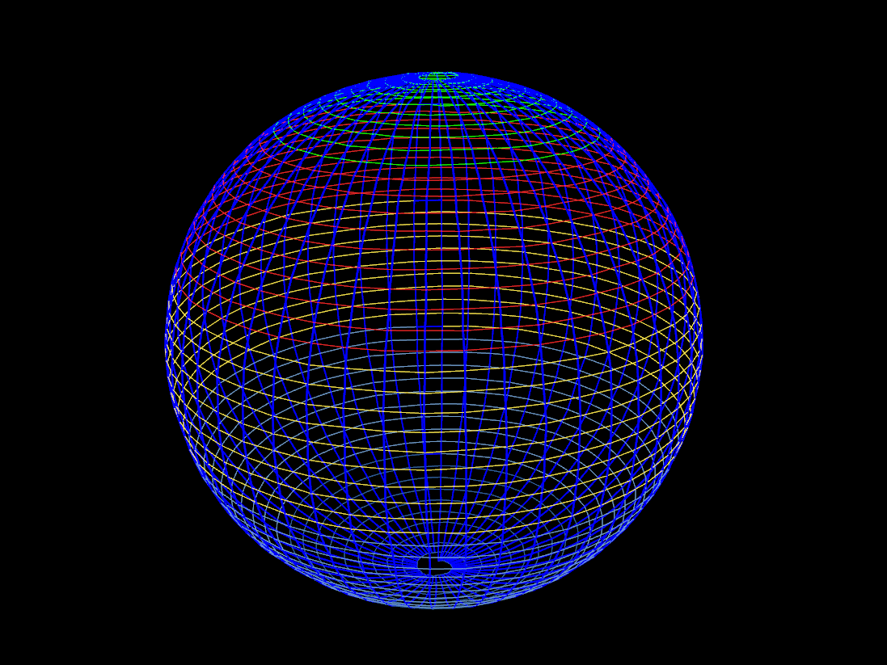

# dpgo_ros

## Introduction
This repository implements a ROS wrapper for the [distributed pose graph optimization (DPGO) library](https://github.com/mit-acl/dpgo).



## Dependencies
Inside a catkin workspace, please clone the following repositories. Use the default branch unless mentioned otherwise below.
* [catkin_simple](https://github.com/catkin/catkin_simple)
* [pose_graph_tools](https://github.com/MIT-SPARK/pose_graph_tools): some tools and ROS messages for working with pose graphs.
* [dpgo](https://github.com/mit-acl/dpgo): core C++ library for distributed PGO. 
* [dpgo_ros](https://github.com/mit-acl/dpgo_ros): this repository.

## Building the package

Build with catkin:
```
catkin build
```

## Examples

### A first demo

Use the following command to run a 5-robot distributed pose graph SLAM demo simulated using the sphere dataset:
```
# source workspace
source ~/catkin_ws/devel/setup.bash

# run demo on example g2o dataset
roslaunch dpgo_ros dpgo_demo.launch local_initialization_method:=Odometry
```

The above example runs the standard dpgo, where each robot's trajectory estimates is initialized using its odometry measurements. The launch file will open a rviz window, which will visualize the iterates produced by dpgo as optimization progresses. You can try out other benchmark datasets by changing the `g2o_dataset` argument in `dpgo_demo.launch`. Take a look inside the `data` directory to see the provided datasets (stored in g2o format).

### Enabling acceleration

DPGO also implements a feature called Nesterov acceleration to speed up convergence of distributed optimization. To enable this, use the `acceleration` argument:
```
# run demo on example g2o dataset
roslaunch dpgo_ros dpgo_demo.launch local_initialization_method:=Odometry acceleration:=true
```
On a test computer with an Intel i7 processor, we observed that acceleration helps to reduce the number of iterations from around 240 to around 150.


### Asynchronous optimization

The following example runs the asynchronous version of dpgo on the sphere dataset:
```
# run demo on example g2o dataset
roslaunch dpgo_ros asapp_demo.launch local_initialization_method:=Odometry RGD_stepsize:=0.2
```
In the command, the `RGD_stepsize` argument controls the local stepsize of agents during asynchronous optimization. More details of this method is described in the following paper.

Y.Tian, A. Koppel, A. S. Bedi, J. P. How.  [**Asynchronous and Parallel Distributed Pose Graph Optimization**](https://arxiv.org/abs/2003.03281), in IEEE Robotics and Automation Letters, 2020, **honorable mention for 2020 RA-L best paper**. 


### Outlier-robust optimization

In practice, multi-robot SLAM systems need to be robust against *outlier* measurements. For example, in distributed visual SLAM, outlier loop closures can be created as a result of incorrect visual place recognition and geometric verification. DPGO supports outlier-robust distributed optimization by implementing the [graduated non-convexity (GNC)](https://ieeexplore.ieee.org/document/8957085) framework in a distributed fashion. The following runs a demo on a real-world 8-robot pose graph SLAM dataset. This dataset was extracted from a multi-robot visual SLAM experiment inside the MIT tunnel systems, and contains many outlier loop closures due to visual ambiguities of the environment.
```
# run demo with robust optimization
roslaunch dpgo_ros dpgo_gnc_demo.launch
```

In the launch file, the key change is setting `robust_cost_type` to `GNC_TLS`, which tells dpgo to optimize the truncated least squares (TLS) objective using GNC (the other option is `L2`, which corresponds to the standard least squares objective). Details of distirbuted GNC can be found in the following paper:

Y. Tian, Y. Chang, F. Herrera Arias, C. Nieto-Granda, J. P. How and L. Carlone, "Kimera-Multi: Robust, Distributed, Dense Metric-Semantic SLAM for Multi-Robot Systems," in IEEE Transactions on Robotics, vol. 38, no. 4, pp. 2022-2038, Aug. 2022, doi: 10.1109/TRO.2021.3137751, [pdf](https://arxiv.org/abs/2106.14386).

## Usage in multi-robot collaborative SLAM

DPGO is currently used as the distributed back-end in [Kimera-Multi](https://github.com/MIT-SPARK/Kimera-Multi), which is a robust and fully distributed system for multi-robot collaborative SLAM. Check out the [full system](https://github.com/MIT-SPARK/Kimera-Multi) as well as the accompanying [datasets](https://github.com/MIT-SPARK/Kimera-Multi-Data)!

## Citations

If you are using this library, please cite the following papers:
```
@ARTICLE{Tian2021Distributed,
  author={Tian, Yulun and Khosoussi, Kasra and Rosen, David M. and How, Jonathan P.},
  journal={IEEE Transactions on Robotics}, 
  title={Distributed Certifiably Correct Pose-Graph Optimization}, 
  year={2021},
  volume={37},
  number={6},
  pages={2137-2156},
  doi={10.1109/TRO.2021.3072346}}

@ARTICLE{Tian2020Asynchronous,
  author={Tian, Yulun and Koppel, Alec and Bedi, Amrit Singh and How, Jonathan P.},
  journal={IEEE Robotics and Automation Letters}, 
  title={Asynchronous and Parallel Distributed Pose Graph Optimization}, 
  year={2020},
  volume={5},
  number={4},
  pages={5819-5826},
  doi={10.1109/LRA.2020.3010216}}
```


